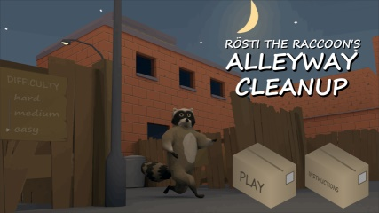
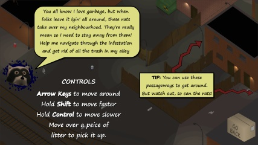
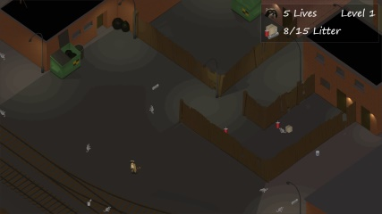
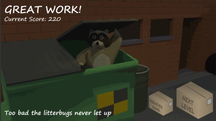
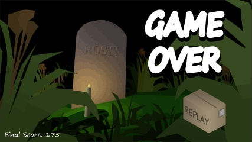

# Rösti the Raccoon's Alleyway Cleanup

Flash game created for a course at St. Lawrence College.

You play as a raccoon picking up the litter that's laying around the alleyway, while avoiding the rats that have taken over. Each level gets progressively harder.

Seeing as Flash Player's end-of-life is coming very soon, I figured I'd get this online before then just in case folks wanna play around with it or look through some simple AS3 code.

## Screenshots

## Play

As far as Flash games go, this one is a little heavy on the graphics. Folks with older/slower computers may experience some frame stuttering or other slowdowns. If this happens, you could try setting the quality to low.

Playable link - Requires a browser that supports Flash Player: [Click Here (external site)](https://cdn.pub.marcellx.ca/flash/rosti-game.html)

## Notice

All graphics, code, and audio (c) Copyright 2020 Marcello Calligaris.
